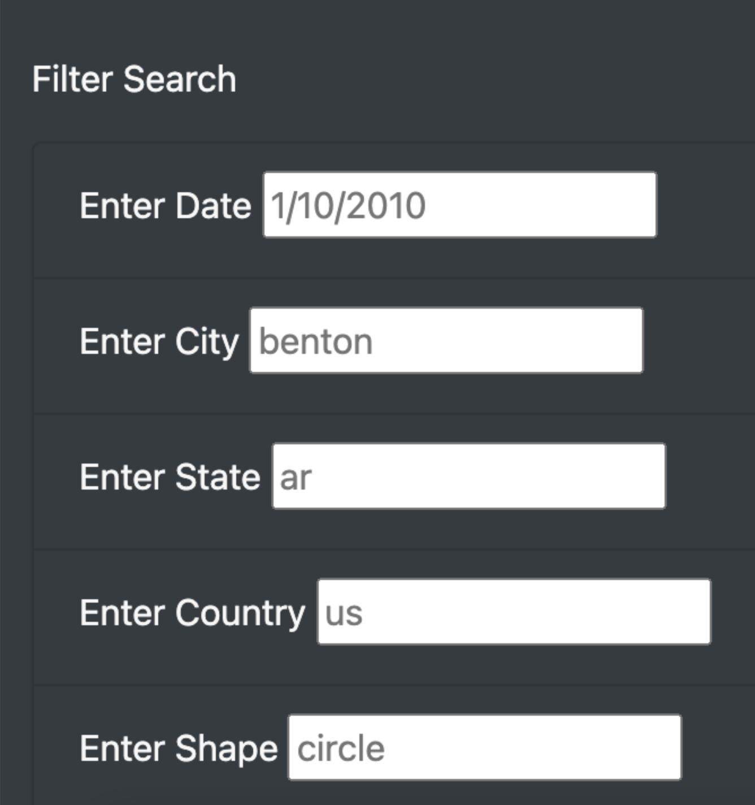
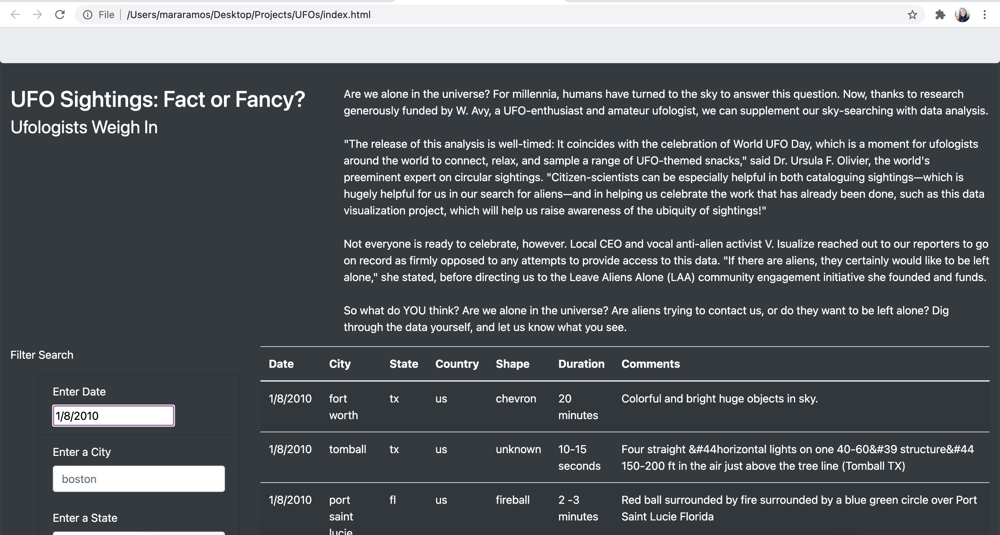
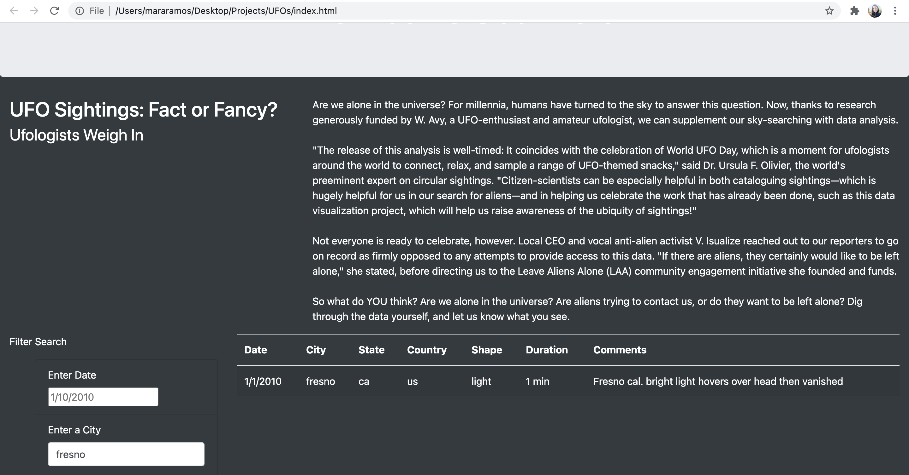

# UFOs

## Overview of the Analysis

In this UFO challenge, the purpose of our project was to answer a simple, taunting question: are we alone in the universe? Dana asked us to create a more in-depth analysis of UFO sighting where we could allow users to filter data based on date, city, state, country, and shape.

## Results

In our results, you can see how the site allows the user to search and data will be filtered to show user input results. 

Here is what our results looked like if for example, a user wanted to filter data based on date:

Here were our results when searching data based on city:

## Summary 

In conclusion, after filtering data and helping Dana with her UFO analysis, there was one drawback that was noted. It is a little time consuming to only be allowed one search query at a time, and the UFO analysis would be a lot more time-efficient if users could search for multiple filters at once. For example, instead of just viewing city like in our results above, searching both time and city at the same time would have saved us a fraction of work and time. 

In addition, recommendations to improve our UFO analysis site came to mind -

1) Make the site more user friendly by perhaps implementing more visual and interactive features like a pop-up window to show our specific results.

2) Improve the visuals of our site by creating a navbar that would implement tabs like the large amount of text describing the UFO analysis when you first launch the site. 

3) To follow the above point of visuals, changing the font and making it more visually appealing as well as including more color might grasp the attention of users in a more beneficial way. 

